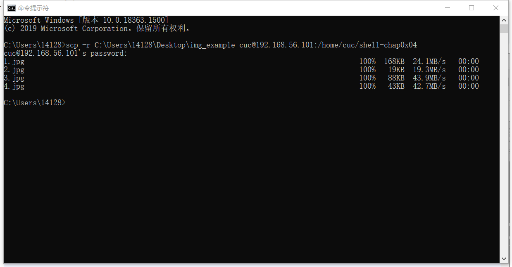
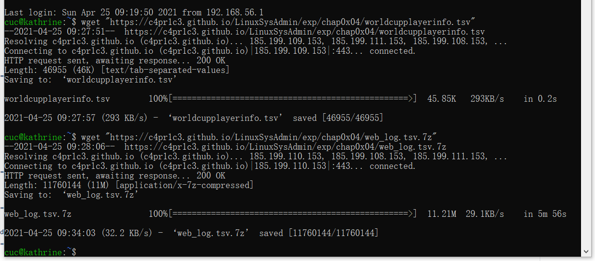
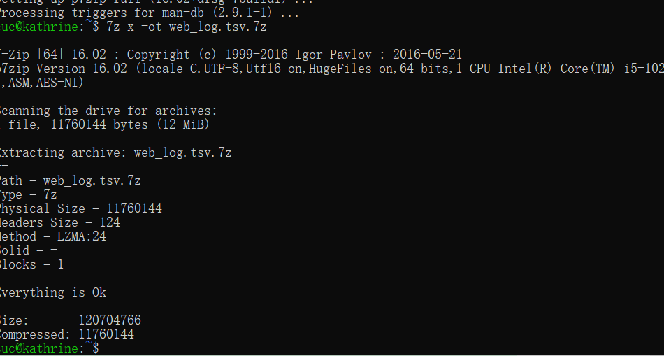
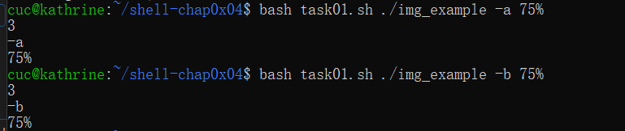
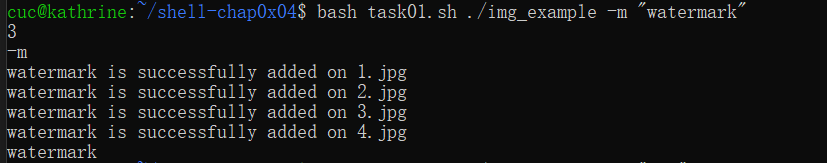
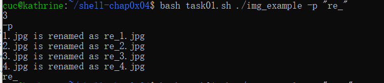
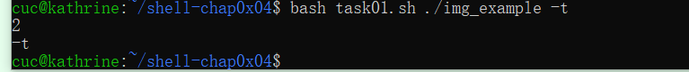
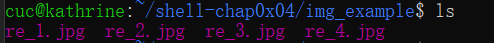

# Shell脚本编程

## 1. 实验环境

- Ubuntu 20.04
- Visual Studio Code
- cmd

## 2. 主要任务

- 任务一：用bash编写一个图片批处理脚本，实现以下功能：

  - [x] 支持命令行参数方式使用不同功能
  - [x] 支持对指定目录下所有支持格式的图片文件进行批处理
  - [x] 支持以下常见图片批处理功能的单独使用或组合使用
  - [x] 支持对jpeg格式图片进行图片质量压缩
  - [x] 支持对jpeg/png/svg格式图片在保持原始宽高比的前提下压缩分辨率
  - [x] 支持对图片批量添加自定义文本水印
  - [x] 支持批量重命名（统一添加文件名前缀或后缀，不影响原始文件扩展名）
  - [x] 支持将png/svg图片统一转换为jpg格式图片
- 任务二：用bash编写一个文本批处理脚本，对*worldcupplayerinfo.tsv*进行批量处理完成相应的数据统计任务：
  - [x] 统计不同年龄区间范围（20岁以下、[20-30]、30岁以上）的球员数量、百分比
  - [x] 统计不同场上位置的球员数量、百分比
  - [x] 名字最长的球员是谁？名字最短的球员是谁？
  - [x] 年龄最大的球员是谁？年龄最小的球员是谁？
- 任务三：用bash编写一个文本批处理脚本，对*web_log.tsv*进行批量处理完成相应的数据统计任务：
  - [x] 统计访问来源主机TOP 100和分别对应出现的总次数
  - [x] 统计访问来源主机TOP 100 IP和分别对应出现的总次数
  - [x] 统计最频繁被访问的URL TOP 100
  - [x] 统计不同响应状态码的出现次数和对应百分比
  - [x] 分别统计不同4XX状态码对应的TOP 10 URL和对应出现的总次数
  - [x] 给定URL输出TOP 100访问来源主机

### 3. 主要实验步骤

#### 测试之前的准备

1、 下载imagemagick

`sudo apt-get update && sudo apt-get install imagemagick`

2、 将测试图片上传到远程Linux

`scp -r C:\Users\14128\Desktop\img_example cuc@192.168.56.101:/home/cuc/shell-chap0x04`

3、下载任务二任务三的资料

`wget "https://c4pr1c3.github.io/LinuxSysAdmin/exp/chap0x04/worldcupplayerinfo.tsv"`
`wget "https://c4pr1c3.github.io/LinuxSysAdmin/exp/chap0x04/web_log.tsv.7z"`

4、上传至远程
`sudo apt install p7zip-full`
`7z x -ot web_log.tsv.7z`

#### 测试shell代码

- 任务一

1）对jpeg格式图片进行图片质量压缩
2）支持对jpeg/png/svg格式图片在保持原始宽高比的前提下压缩分辨率

3）支持对图片批量添加自定义文本水印

4)添加前缀后缀

5)将png/svg图片统一转换为jpg格式

4、将处理后的图片拷到本地

`scp -r cuc@192.168.56.101:/home/cuc/shell-chap0x04/img_example C:/Users/14128/Desktop`

- 任务二、任务三执行语句及实验结果

1、任务二
`bash task3.sh ./data/worldcupplayerinfo.tsv -a`
`bash task3.sh ./data/worldcupplayerinfo.tsv -b`
`bash task3.sh ./data/worldcupplayerinfo.tsv -c`
`bash task3.sh ./data/worldcupplayerinfo.tsv -d`
[[点击此处查看实验结果]](任务二任务三实验结果.md)
2、任务三
`bash task22.sh ./data/web_log.tsv -a`
`bash task22.sh ./data/web_log.tsv -b`
`bash task22.sh ./data/web_log.tsv -c`
`bash task22.sh ./data/web_log.tsv -d`
`bash task22.sh ./data/web_log.tsv -e`
`bash task22.sh ./data/web_log.tsv -f`
[[点击此处查看实验结果]](任务二任务三实验结果.md)
### 4. 参考资料

- [2020级同学的代码](https://github.com/CUCCS/linux-2020-ididChan/blob/homework04/homework04/%E5%AE%9E%E9%AA%8C%E6%8A%A5%E5%91%8A.md)
- [ImageMagick官方参考文档](https://imagemagick.org/)
- [Linux awk 命令](https://www.runoob.com/linux/linux-comm-awk.html)
- [Linux-管理文件-4-文本行处理（awk）](https://qinqianshan.com/unix/linux/text-awk/)

- [awk 数组排序多种实现方法](https://www.cnblogs.com/chengmo/archive/2010/10/09/1846696.html)
- [AWK与SHELL之间的变量传递方法](http://smilejay.com/2011/09/awk-shell-variable/)
- [$filename使用方法](https://zhidao.baidu.com/question/409152555.html)
- [scp命令](https://www.runoob.com/linux/linux-comm-scp.html)